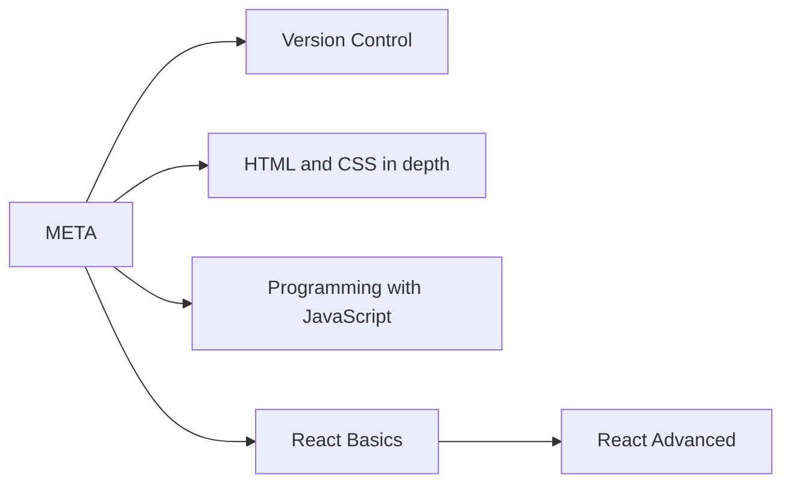

# Willkommen auf meinem Profil!
---

Hi, ich bin MrMister20257 und passionierter Web-Entwickler in spe 💻💪

Aktuell arbeite ich an einer PWA ([Progressive Web Application](https://de.wikipedia.org/wiki/Progressive_Web_App)), in der ich diverse Tools für eine Community zur Verfügung stelle, die schnelle und nützliche Berechnungen mit JavaScript durchführen. Ich programmiere gerne [Singlepage Applications](https://de.wikipedia.org/wiki/Single-Page-Webanwendung) mit dem Framework React und versuche meine Fähigkeiten stets zu verbessern. 

*Keine Macht dem **~~Prop Drilling~~**!* 😜
 

Des Weiteren arbeite ich mit Python, um meine täglichen API Abfragen durchführen zu können. 

*Hmmmm **Rohdaten!*** 🤤😍
 

---

Ich habe bereits folgende Zertifikate erzielt:

 
... drei fehlen noch aber sind schon in Arbeit!

---

Also dann, viel Spaß beim Stöbern und bis bald! 🖐😎

